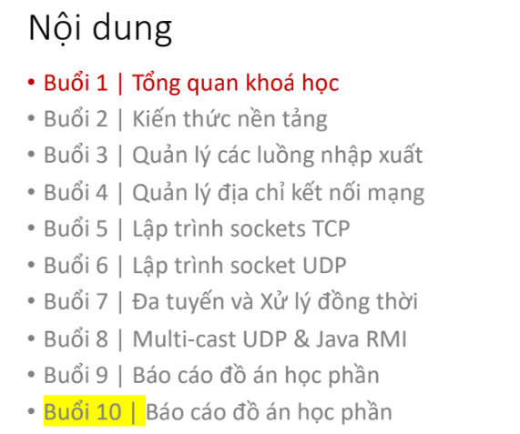
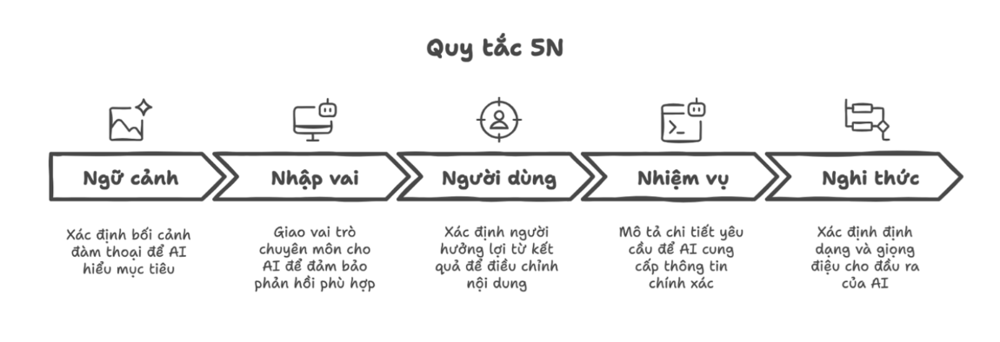

---
title: "Bài 1: Tổng quan khoá học"
date: 2025-12-15
weight: 1
draft: false
tags: ["Java", "Network"]
summary: "GIỚI THIỆU HỌC PHẦN."
---

## Giới thiệu
Chào mừng đến với học phần **Lập trình Mạng máy tính (CMP180)**. <!-- cite --><!-- refs: 17,19,20 -->

**Mục tiêu cốt lõi:**
* <!-- cite --> <!-- refs: 22 --> Thiết kế và triển khai các ứng dụng mạng từ đơn giản đến phức tạp.
* <!-- cite --> <!-- refs: 23 --> Hiểu sâu về cơ chế hoạt động bên dưới của các ứng dụng mạng.

## Nội dung bài học

### 1. Lộ trình học tập (10 Buổi)
<!-- cite --><!-- refs: 28-38 --> Khóa học được chia thành các giai đoạn rõ ràng, đi từ kiến thức nền tảng đến thực hành chuyên sâu:

* **Buổi 1-2:** Tổng quan & Kiến thức nền tảng.
* **Buổi 3-4:** Quản lý luồng nhập xuất (I/O) & Địa chỉ mạng.
* **Buổi 5-6:** Lập trình Socket TCP & UDP.
* **Buổi 7-8:** Đa tuyến (Multithreading), Multicast UDP & Java RMI.
* **Buổi 9-10:** Báo cáo đồ án học phần.

### 2. Phương pháp học tập mới: AI Mentor & Tư duy phản biện
Điểm đặc biệt của khóa học là cách tiếp cận "Học cùng AI" nhưng không phụ thuộc vào AI.

* <!-- cite --><!-- refs: 140,201 --> **Mô hình AI:** Chuyển từ AI-Thợ (Assistant) sang **AI-Thầy (Mentor)**. Sử dụng AI để hỏi ngược, giải thích nguyên lý thay vì chỉ xin code.
* <!-- cite --><!-- refs: 85-90 --> **Hiệu ứng Dunning-Kruger:** Nhận thức rõ mình đang ở đâu để kiên trì phát triển.
* <!-- cite --><!-- refs: 211-216 --> **5 Kỹ năng tư duy phản biện (Critical Thinking):** Phân tích, Đánh giá, Suy luận, Giải quyết vấn đề, Giao tiếp.

### 3. Đánh giá & Quy tắc lớp học
* <!-- cite --><!-- refs: 76-80 --> **Điểm số:** 50% Quá trình (Chuyên cần, Check-in, Thuyết trình) + 50% Cuối kỳ (Đồ án cá nhân).
* <!-- cite --><!-- refs: 51-57 --> **Tác phong "Đi học như Đi làm":** Đúng giờ, chuyên nghiệp trong email/đặt tên file, và không chơi game trong giờ.

## Mục tiêu đầu ra (KSA Model)
<!-- cite --><!-- refs: 39-50 --> Sau khóa học, kỹ sư tương lai cần đạt được:

1.  **Kiến thức (Knowledge):** Hiểu rõ kiến trúc mạng, giao thức và ngôn ngữ Java.
2.  **Kỹ năng (Skills):** Thành thạo lập trình mạng (Java/JS), làm việc nhóm và giải quyết vấn đề.
3.  **Thái độ (Attitude):** Chuyên nghiệp, chủ động.

## Tài nguyên học tập
<!-- cite --><!-- refs: 59-74 --> Để bắt đầu, hãy cài đặt và chuẩn bị các công cụ sau:

* **IDE:** [IntelliJ IDEA](https://www.jetbrains.com/idea/) hoặc Netbeans.
* **Sách tham khảo (Must-read):**
    * *Java Network Programming* (Elliotte Rusty Harold).
    * *Head First Java* (Kathy Sierra).
    * *Computer Networking: A Top-Down Approach* (Kurose & Ross).
* **Công cụ báo cáo:** GitHub (quản lý code), Hugo/Publii (viết blog).

## Ví dụ / Ghi chú: Kỹ thuật Prompt 5N
<!-- cite --><!-- refs: 148-160 --> Để khai thác AI hiệu quả như một kỹ sư thực thụ, hãy áp dụng quy tắc **5N** khi đặt câu hỏi (Prompt):

1.  **Ngữ cảnh (Context):** Bạn là ai? Bối cảnh là gì?
2.  **Nhập vai (Role):** AI đóng vai trò gì (VD: Senior Engineer)?
3.  **Người dùng (User):** Ai đọc kết quả?
4.  **Nhiệm vụ (Task):** Việc cần làm cụ thể.
5.  **Nghi thức (Format):** Định dạng đầu ra.

## Tài liệu tham khảo
<!-- Tham khảo chi tiết được giữ riêng trong tài liệu khóa học / syllabus. -->